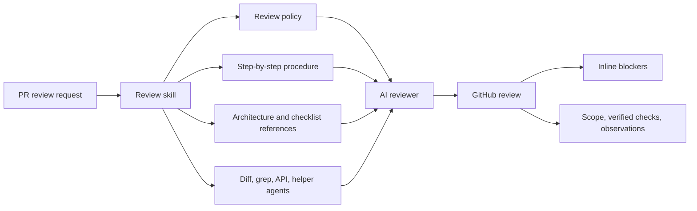
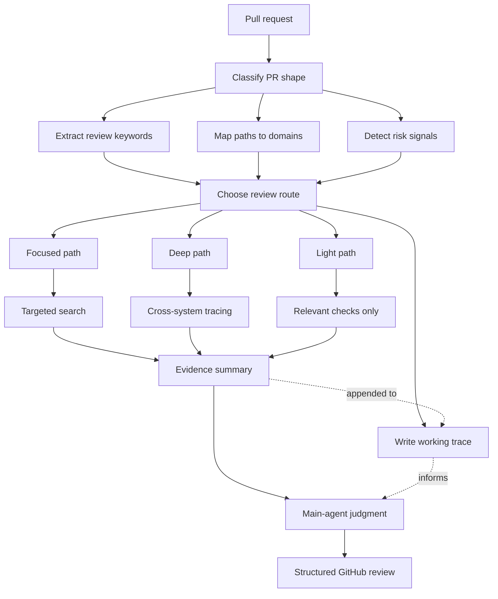
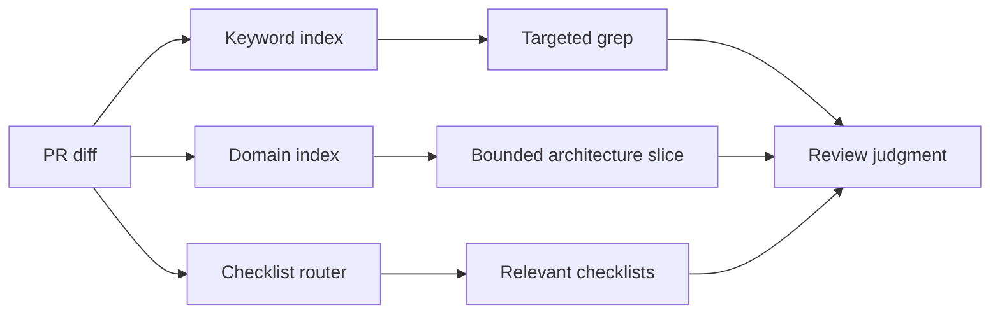
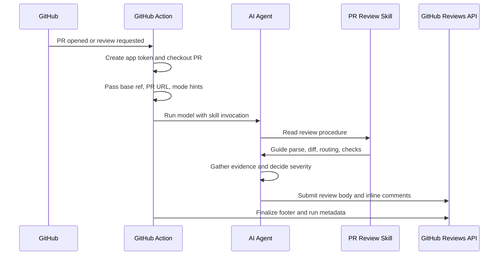
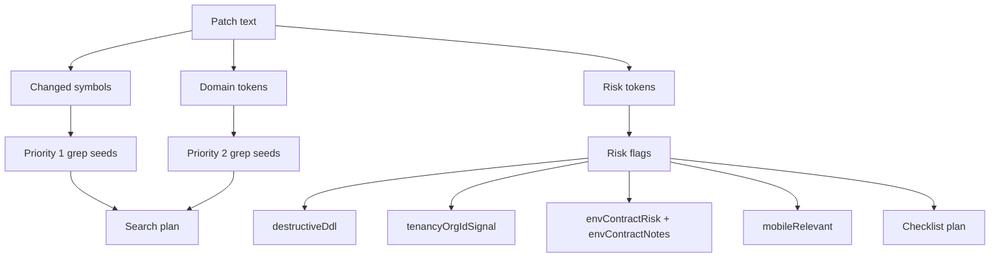
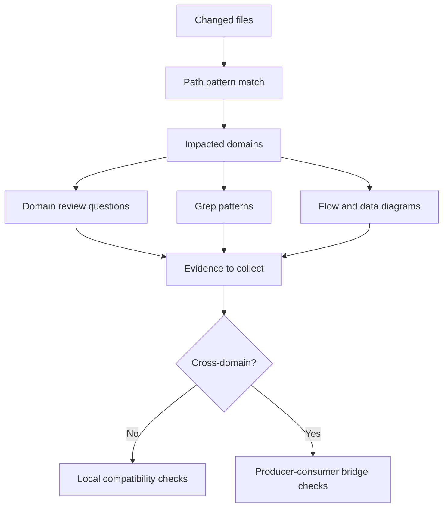
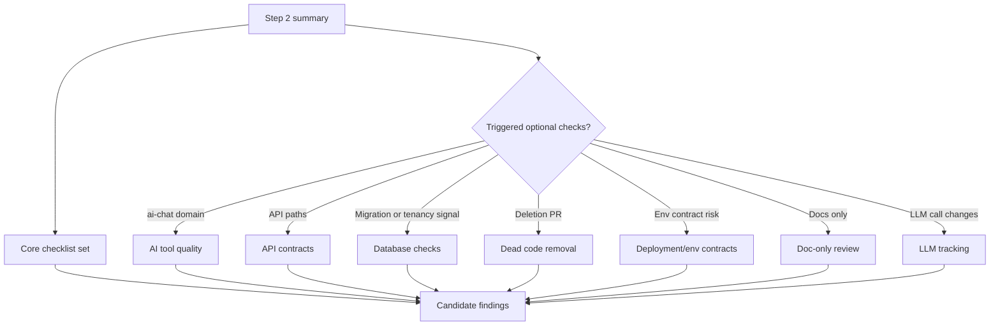
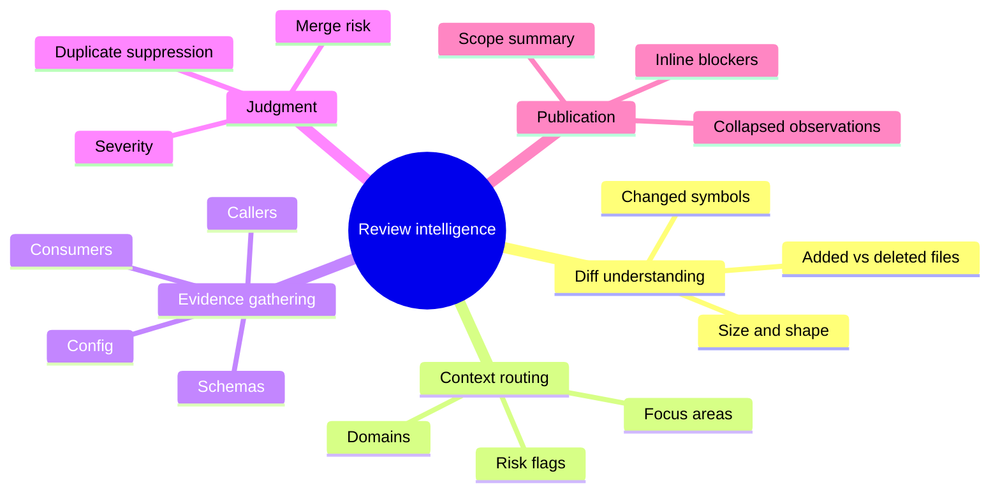
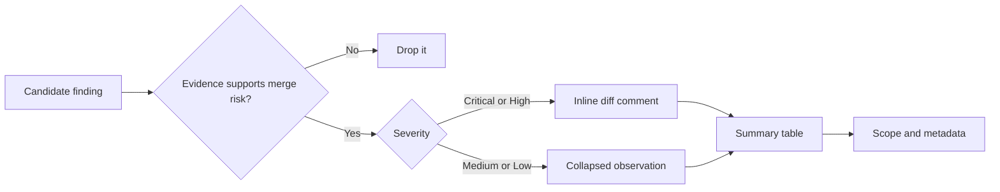
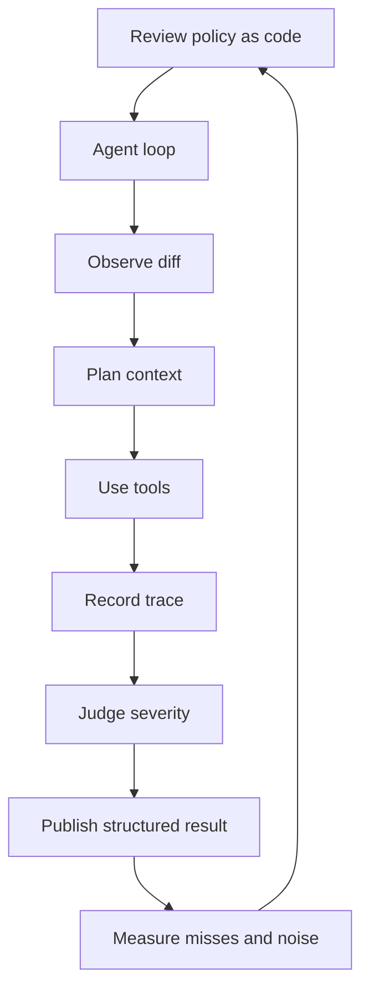

# Case 1 - Code Review Skill + E2E testing agent

| Dimension          | Does the code look well?                       | Does the product actually work?                                 |
| ------------------ | ---------------------------------------------- | --------------------------------------------------------------- |
| **Review type**    | Structural (is it safe/correct?)               | Behavioral (does it work?)                                      |
| **Primary input**  | PR diffs + full codebase + architecture        | PR metadata + diffs + deployments                               |
| **Code access**    | Diffs + grep + file reads + architecture index | Diffs (patches), PR description, commits — no full repo or grep |
| **Test execution** | No                                             | Yes — runs E2E on PR preview                                    |
| **Runs where**     | Cursor IDE, GitHub Actions, Cursor Cloud       | QA.tech SaaS (Inngest)                                          |
| **Trigger**        | GitHub mention, Automation, Command            | Deployment webhook, `@QA.tech` mention                          |

### Code Review Agent

Is in fact a PR review skill that runs in Cursor CLI using Composer-2 (or IDE using a /command) and gives the model an operating system for review:

- A way to classify the shape of the pull request before spending context.
- A scratchpad so the agent externalizes state instead of relying on short-term memory.
- A domain map so changed files route to relevant architecture and checklist knowledge.
- A bounded tool strategy so grep, diff summarization, and helper agents do not flood the main reasoning context.
- A publication contract so the final GitHub review is consistent, sparse, and merge-focused.

The skill is optimized around one question: **is there anything in this PR that should block merge?**

## What Makes It Interesting

- **Keyword extraction as the review compass**
  - Extracts changed symbols, domain identifiers, schemas, events, tool names, API contracts, env vars, and migration tokens.
  - Turns those keywords into grep seeds and the final review scope summary.
- **Path-to-domain indexing**
  - Maps changed paths into architectural domains.
  - Loads a bounded architecture slice instead of the whole repository.
- **Checklist routing**
  - Keeps checklists conditional rather than always-on.
  - Loads checks based on domains, risk signals, and explicit user focus.
- **A single working trace**
  - Records parsed inputs, file summaries, searched keywords, checklist results, architecture conclusions, and draft findings.
  - Gives the agent a memory layer outside the model context.
- **Subagents for noisy work**
  - Delegates diff summarization, grep, and checklist collection to subagents when useful.
  - Keeps the main agent's context clean for reasoning, severity, and final review judgment.
  - Ensures subagents collect evidence, while the main agent decides what matters.

## The result is a retrieval and routing system where the model first builds a compact index of the PR, then spends context according to that index.

## How The Workflow Runs

In GitHub Actions, the workflow is the launcher and the skill is the reviewer. The workflow creates an authenticated environment, checks out the PR, passes PR metadata to the agent, and instructs the agent to read and execute the skill. The agent then performs the review and posts back to GitHub.

This separation matters. The workflow owns operational concerns: authentication, repository checkout, retrying transient agent failures, and final metadata updates. The skill owns reviewer behavior: what to inspect, how to reason, what to call a blocker, and how to format the review.

## Keyword Logic

The keyword system is one of the main reasons the skill performs well. It prevents the agent from treating every string in the diff as equally important.

The extraction has three layers:

- **Priority 1:** changed exported symbols, functions, methods, types, constants, and other identifiers likely to have callers.
- **Priority 2:** domain-specific identifiers such as tool definitions, agent definitions, Zod schemas, events, tables, RPCs, GraphQL operations, env vars, and public contract names.
- **Priority 3:** noisy tokens to ignore, such as import paths and local variables.

Some keywords are also risk signals. For example, migration patches are scanned for `drop column`, `rename column`, risky `alter column`, `create or replace function`, `row(` composite arguments, `create_*` RPC names, and `*_with_*` function names. Environment changes extract old/new variable names so the review can mechanically search for orphaned old names and missing new names.

This is the difference between generic review and useful agentic review: the agent is taught what identifiers are likely to reveal blast radius.

## Domain Logic

The skill keeps an architecture index that maps paths to domains and gives each domain bounded review context: entry points, grep patterns, diagrams, relationships, and review questions. The agent reads only the slice it needs.

This is important because architecture knowledge is expensive. If a PR touches a database migration, the agent should look at schema and consumer relationships. If it touches a queue or event boundary, it should look at payload producers and handlers. If it touches AI tool code, it should look at tool registration, schema descriptions, timeouts, and downstream UI consumers.

The index is intentionally a bounded loader, not a knowledge dump. The agent starts with review questions, then only loads system flow or data relationships when the PR shape requires them.

## Checklist Router

The checklist system is another key performance feature. The skill has a core checklist set plus optional checklists loaded only when triggered.

Core checks run first:

- Security
- Type completeness
- Code cleanliness
- Code logic
- Dependencies

Optional checks load when the diff shape calls for them:

- AI tool quality
- API contracts
- Database and schema behavior
- Dead code removal
- Deployment and environment contracts
- Documentation-only review
- LLM tracking

This is where the skill avoids the usual AI-review failure mode: loading every checklist for every PR and producing generic noise. Review depth is routed by evidence.

## What It Checks

The skill checks for high-impact failure modes, not every possible improvement. It is strongest when a PR changes contracts between parts of a system.

- **Security and authorization:** secrets, trust boundaries, access checks, unsafe automation, and authorization drift.
- **Runtime correctness:** broken call sites, changed behavior, bad edge cases, unsafe assumptions, and error handling that changes outcomes.
- **Contracts:** APIs, event payloads, schemas, generated types, environment variables, deployment configuration, and producer-consumer compatibility.
- **Persistence:** migrations, destructive schema changes, row-level security, default-value behavior, and app code that no longer matches stored data.
- **Deletion safety:** removed files, symbols, or modules that still have active references.
- **Cross-domain interactions:** data or control flow moving from one subsystem to another.
- **Documentation and tooling:** broken references, unclear instructions, workflow behavior, and whether automation contracts still line up.

Some checks are especially interesting because they combine diff analysis with codebase search:

- **Explicit NULL versus database defaults:** If a migration adds a default and app code passes `null` through an RPC or insert path, PostgreSQL will not apply the default. The skill looks for that migration-plus-write-path combination.
- **Destructive schema change versus surviving consumers:** If a column is dropped or renamed, the skill searches app and package code for surviving references to the old name.
- **Environment variable rename symmetry:** If an env var is renamed, the skill checks both old-name orphans and new-name documentation/consumer coverage.
- **AI tool contract drift:** If an AI tool changes, the skill checks tool descriptions, Zod schemas, registration, timeouts, subagent limits, async event payloads, and UI output shape.
- **Deletion orphan checks:** If a PR removes files or symbols, the skill searches for active surviving references before calling the deletion safe.

## What It Does Not Check

The skill is deliberately not a replacement for normal engineering gates.

It does not replace unit tests, type checking, static analysis, security audits, load tests, product review, or human design review. It also does not try to be a style cop. Naming preferences, formatting, minor refactors, and "this could be cleaner" feedback are intentionally out of scope unless they create a real merge risk.

It also does not try to exhaustively read the whole repository. That is a design choice. Exhaustive exploration is expensive, noisy, and often worse than a targeted search plan. The skill tries to be evidence-driven: read enough context to validate or reject high-impact risks, then stop.

## Output Discipline

Critical and high-severity findings become inline review comments because they should interrupt the author. Medium and low-severity findings are collapsed, summarized, or omitted. The review starts with a direct verdict so readers immediately know whether the bot believes the PR is merge-blocked.

## The Core Design Pattern

The useful mental model is: **a PR review skill is an agent harness for engineering judgment.** The model provides reasoning, but the skill provides the rails: scope, memory, tools, severity, and output discipline.
