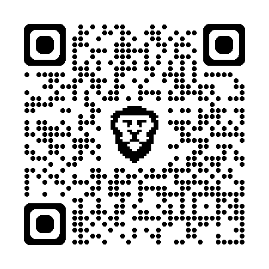

# Agentic AI Quality Assurance: How to Scale Software Testing When AI Accelerates Code Delivery
## DevDays & DevOps Pro, May 20

### Olle Pridiuksson (Solutions Engineer - Agentic AI at QA tech)

- [Single link to learn more about me](https://www.linkedin.com/pulse/vibe-living-vs-agentic-olle-pridiuksson-twfzf/)
- LinkedIn: <https://www.linkedin.com/in/pridiuksson>  
- Instagram: <https://www.instagram.com/pridiuksson>  
- Twitter: <https://x.com/pridiuksson>  

## My Single Main Key Message:
* Humans and agents should exist together in the same environment and collaborate in unique ways it makes sense

## [1 - QAtech](Case%201/)
* Humans-first, agents-augmented
* Code Review Agent + E2E QA.tech Agent in CI
* Slack -> Linear -> Cursor -> PR -> Code Review + E2E review -> Main -> Live

## [2 - Project Q](Case%202/) 
* Agents-first system, humans make all key decisions
* Agents plan, implement, test, maintain tech specs
* Plan -> Peer Reviw/Grill -> Execute -> Test/Test New -> Validate -> Commit -> Create PR -> Review

## [3 - Project P](Case%203/)
* Assign tasks to humans or agents and back
* Agents learn work from humans
* Agents decide on the process

# Before you ask:

