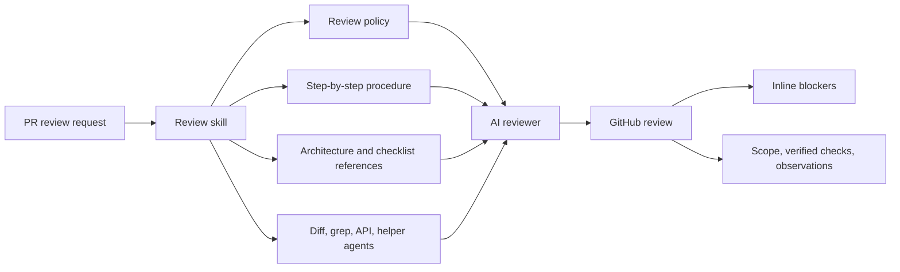

# Agentic AI Quality Assurance: How to Scale Software Testing When AI Accelerates Code Delivery
## DevDays & DevOps Pro, May 20

### Olle Pridiuksson (Solutions Engineer - Agentic AI at QA tech)

- [Single link to learn more about me](https://www.linkedin.com/pulse/vibe-living-vs-agentic-olle-pridiuksson-twfzf/)
- LinkedIn: <https://www.linkedin.com/in/pridiuksson>  
- Instagram: <https://www.instagram.com/pridiuksson>  
- Twitter: <https://x.com/pridiuksson>  

## My Single Main Key Message:
* Agents and humans exist together and collaborate in a way it makes sense

## Case 1 - QAtech: Two PR Review Systems: Code Review Agent vs E2E QA.tech Agent

| Dimension          | Does the code look well?                       | Does the product actually work?                                 |
| ------------------ | ---------------------------------------------- | --------------------------------------------------------------- |
| **Review type**    | Structural (is it safe/correct?)               | Behavioral (does it work?)                                      |
| **Primary input**  | PR diffs + full codebase + architecture        | PR metadata + diffs + deployments                               |
| **Code access**    | Diffs + grep + file reads + architecture index | Diffs (patches), PR description, commits — no full repo or grep |
| **Test execution** | No                                             | Yes — runs E2E on PR preview                                    |
| **Runs where**     | Cursor IDE, GitHub Actions, Cursor Cloud       | QA.tech SaaS (Inngest)                                          |
| **Trigger**        | GitHub mention, Automation, Command            | Deployment webhook, `@QA.tech` mention                          |

### Code Review Agent

Is in fact a PR review skill that runs in Cursor CLI using Composer-2 (or IDE using a /command) and gives the model an operating system for review:

- A way to classify the shape of the pull request before spending context.
- A scratchpad so the agent externalizes state instead of relying on short-term memory.
- A domain map so changed files route to relevant architecture and checklist knowledge.
- A bounded tool strategy so grep, diff summarization, and helper agents do not flood the main reasoning context.
- A publication contract so the final GitHub review is consistent, sparse, and merge-focused.

The skill is optimized around one question: **is there anything in this PR that should block merge?**

